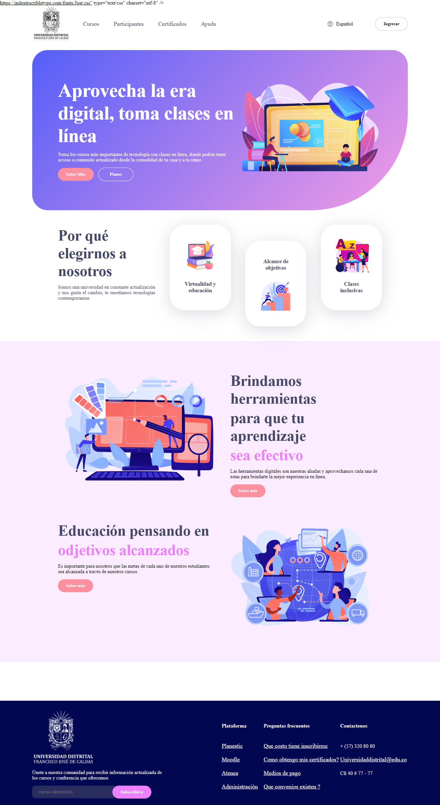
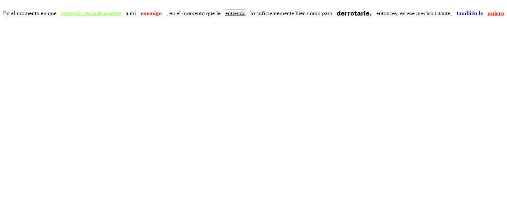
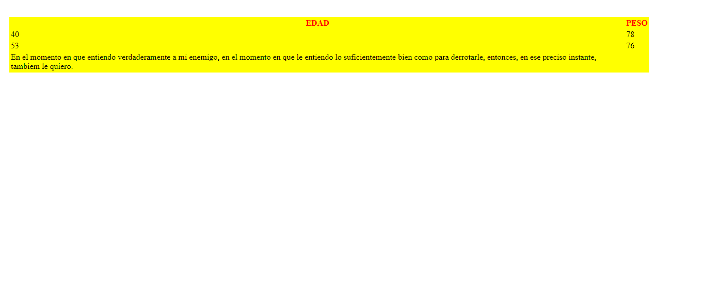

<h1>TALLER 9: Iván Flórez</h1>

<h1>Información</h1> 

Curso: Full Stack Básico - Grupo 1
  

Profesor: Crístian Patiño

<h2>Punto 1: Link de figma</h2>

<a href="https://www.figma.com/file/HnKQ5d4eBpjMSV7HWw3Vk0/RITA-Iv%C3%A1n-Fl%C3%B3rez?type=design&node-id=0-1&t=diEJ0YGXais14xRL-0" target="_blank"> Link de figma</a>

<h2> Page_css</h2>
    <a href="file:///C:/Users/User/Downloads/PERSONALES/Full%20Stack%20Program/Taller%209/taller-9-full-stack-1/Punto%20-1-3/index.html " target="_page_"> Page_css</a>
<h2> Punto 2: HTML</h2>

<h2> Punto 4: HTML</h2>

<h2> Punto 5: HTML</h2>

<h2> Punto 6: HTML</h2>

<h2> Punto 7-8: HTML</h2>

<h2> Punto 9: HTML</h2>

